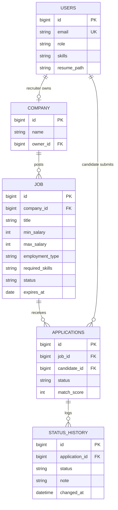

# Architecture and design decisions

## Layers
```
Browser (HTML/CSS/JS) -> Controllers -> Services -> Repositories -> PostgreSQL
                         (HTTP, DTOs)   (rules)     (Spring Data JPA)
```
- **Controller:** receives the request, validates input, calls a service.
- **Service:** business rules (ownership checks, duplicate prevention, match scoring, expiry).
- **Repository:** database access only.
- **DTOs** (Java records): the API never returns entities, so password hashes can't leak.

## ER diagram

`applications` has a unique constraint on (job_id, candidate_id).

## Design decisions

| Decision | Why | Trade-off |
|---|---|---|
| One `users` table with a `role` column | Both user types share registration and login | Candidate-only columns are empty for recruiters |
| Stateless JWT authentication | No server session, simple to deploy and scale | A token can't be revoked before it expires |
| Role rules at URL level (`/api/recruiter/**`, `/api/candidate/**`) | The two workflows are separated in one place | Ownership (own jobs only) is checked again in the services |
| Separate `status_history` table | Gives candidates a timeline and recruiters an audit trail | One extra insert per status change |
| Skills stored as a normalized comma-separated string | Simple and quick to build | A separate skills table would be more flexible |
| Resumes on disk, only the file name in the database | Small database, easy to back up | Local disk doesn't scale across servers; S3 is the next step |
| JPA Specifications for search | Filters combine dynamically without many query variants | Harder to read than plain SQL |
| Expiry is calculated from the date when a job is read or saved | Correct even before the daily task runs | The stored status can lag behind until the task runs |

## Unique features
1. **Skill-match score:** the share of a job's required skills that a candidate has. It ranks recommended jobs, sorts applicants for recruiters, and lists the missing skills.
2. **Status timeline:** every stage change is stored with a note and a time.
3. **Recruiter funnel dashboard:** counts per hiring stage and the average match score per job.
4. **Integrity rules:** no duplicate applications, a resume is required before applying, OFFERED and REJECTED are final, and recruiters only touch their own jobs and applicants.
5. **Automatic expiry:** a job with a past expiry date is closed on save and by a daily scheduled task.

## Known limitations and next steps
- Store resumes in S3 with time-limited download links.
- Add refresh tokens and password reset.
- Replace comma-separated skills with a skills table.
- Add automated tests and a CI pipeline.
- Add email notifications on status changes.